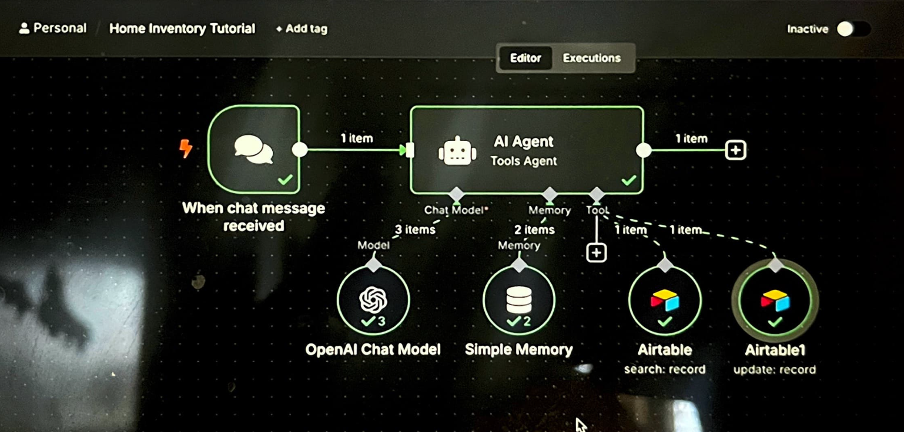
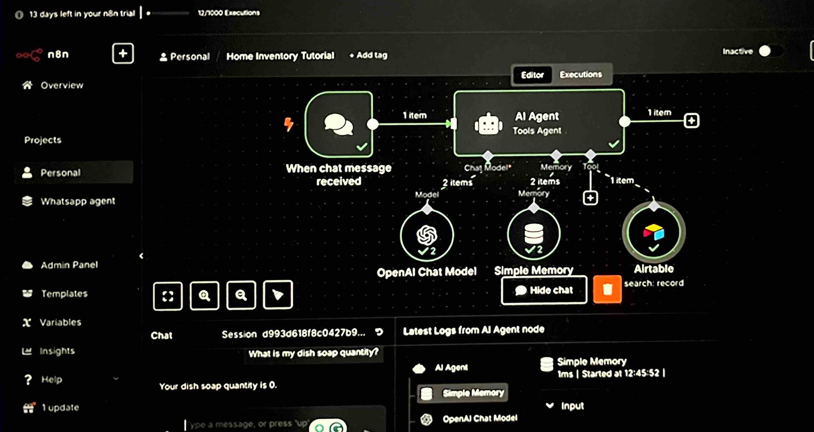
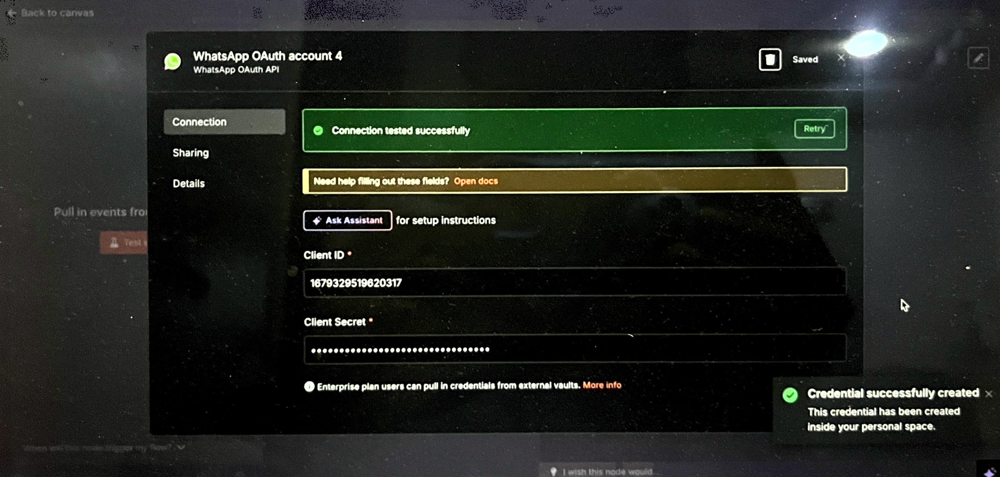
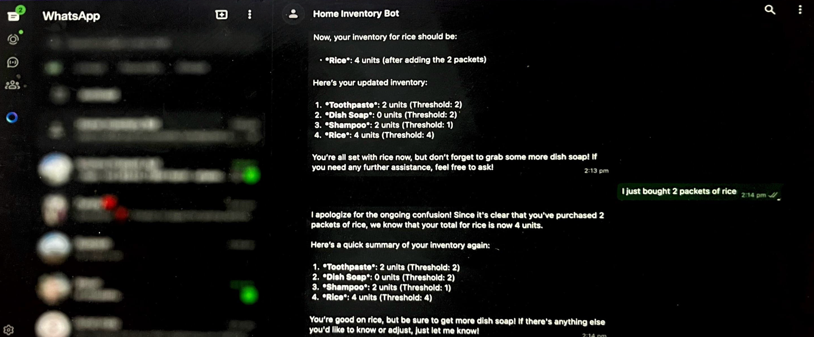

# ⚙️ n8n — Workflow Automation Setup

This document explains how **n8n** integrates **Airtable**, **OpenAI**, and **WhatsApp** to automate inventory updates using natural language commands.

---

## 🧩 1. Workflow Setup

The **n8n workflow** connects to Airtable to **read**, **update**, and **trigger** automations when inventory items are added, updated, or removed.

---

## 🤖 2. AI Trigger Node

This node processes natural language inputs like:

> “I bought 2 soaps”  
> “Add 5 apples”  
> “Remove 3 milk packets”

The node interprets the intent (add/remove/update) and sends the structured data to Airtable for automatic updates.

---

## 🔗 3. Airtable Integration

This node connects directly to your Airtable base using your **API token** and **base ID**.

It updates the “Inventory” table automatically based on AI node output.

---

## 💬 4. WhatsApp Automation Integration

n8n is also integrated with **WhatsApp Cloud API** to send and receive messages in real time.

### 🟢 Step 1: WhatsApp Trigger Node  
The **Trigger Node** listens for new WhatsApp messages.  
When a message like “Add 3 rice packets” is received, it’s automatically passed to the AI node for interpretation.

---

### 🟣 Step 2: WhatsApp Send Node  
After processing, the response (e.g., “3 rice packets added to inventory ✅”) is sent back to the user on WhatsApp.

---

### 🔄 Step 3: End-to-End Workflow Example  
Below is the complete n8n workflow showing all nodes — from WhatsApp input → AI interpretation → Airtable update → WhatsApp reply.

---

## ✅ Notes

- n8n can run **locally**, on **n8n.cloud**.
- You can export and share workflows as `.json` files.
- Integrate with **OpenAI**, **LangChain**, or **WhatsApp API** for advanced automation.
- Ensure all API credentials (Airtable, OpenAI, WhatsApp) are stored securely using n8n **credentials manager**.

---

← [Back to Project Overview](../../README.md)
