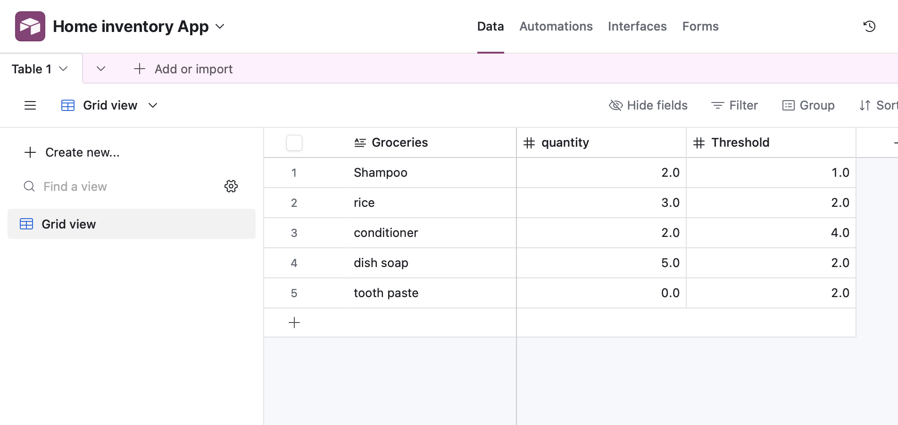
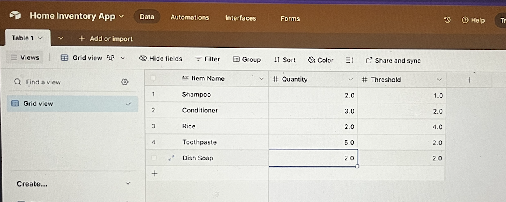

# 🧩 Airtable — Setup & Screenshots

This document shows how **Airtable** is used as the backend database in the **AI-Powered Home Inventory Assistant** project.

Airtable acts as a smart spreadsheet that stores inventory items, quantities, and thresholds.  
It integrates seamlessly with **n8n** automation flows to read, update, and manage your stock dynamically.

---

## 🧠 1. Base Setup

This is the main Airtable base where all inventory data is stored.

### 🔹 Airtable Base Structure

### 🔹 API Token Generation
To connect Airtable to n8n, you need an API token.

Steps:
1. Go to [https://airtable.com/create/tokens](https://airtable.com/create/tokens)
2. Create a new token named **Home Inventory Tutorial**
3. Enable “read/write” and “schema” permissions
4. Copy the token for use in n8n

---

## 🔄 2. Inventory Updates

The Airtable base tracks stock quantities and triggers alerts if thresholds are crossed.

### 📸 Before Update
This screenshot shows your data **before** an item update.

### 📸 After Update
This screenshot shows the updated data **after automation** via n8n.

---

## 💬 Notes

- **Base name:** Home Inventory App  
- **Columns:** Item Name, Quantity, Threshold  
- **Automation:** n8n updates these records automatically based on natural language messages (e.g., “I bought 2 soaps”).  

---

✅ You can return to the main documentation here:  
[← Back to Project Overview](../../README.md)
